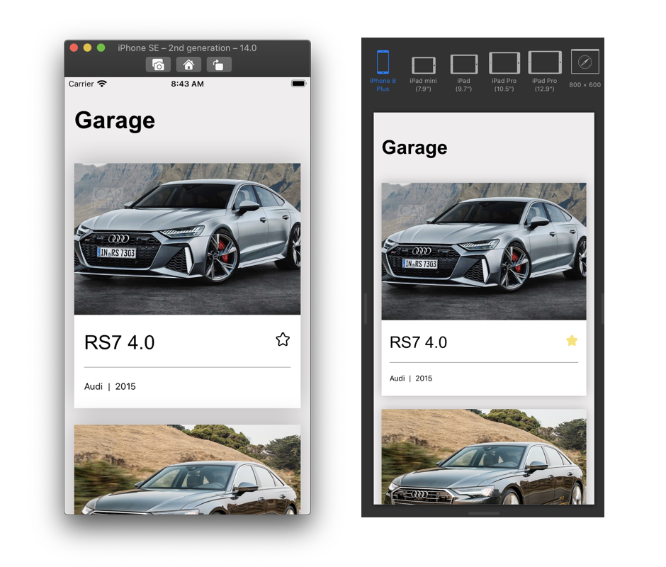

# Code Challenge - ITCrowd

---

## Garage APP

This repo is a working project that lists cars based on a local API response. It contains both the backend and the frontend app, and it aims at testing candidates' abilities to solve real-world problems without demanding too much time to set up everything.

## Frontend Challenge

- [X] Implement a list for showing all cars using the currently implemented car item in the Garage screen as a base following as reference the screenshot above.

- [X] Feed the list with data from the node API available in `backend` folder, keep it as simple as possible.

- [X] Refactor the code using whatever best practices you see fit.

- [X] Implement a `Detail` screen, following the same design principles and using the same information already provided.

- [X] Implement a "favorite" feature using Redux as your global state manager, so users are able to toggle stars on and off between both Garage and Detail screens.

- [X] Add persistence (offline saving) to toggling stars functionality - can be manually or using a lib.

## Environment Setup
Follow the official React Native documentation to setting up your environment: [reactnative.dev/docs/environment-setup](https://reactnative.dev/docs/environment-setup)

## Running
1. Clone this repository.
2. Run `yarn install` command inside frontend and backend folder.
3. Run `yarn run dev`command inside backend folder, to run the local API. 
4. Run `yarn run android` inside frontend folder to run the app on an android device or emulator.

Note: [The default localhost for android emulator is 10.0.2.2](https://developer.android.com/studio/run/emulator-networking). If you run in a different emulator/device you need to change the baseUrl in the file [frontend\src\config\api\index.ts](https://github.com/rorlf/garage/blob/main/frontend/src/config/api/index.ts).
